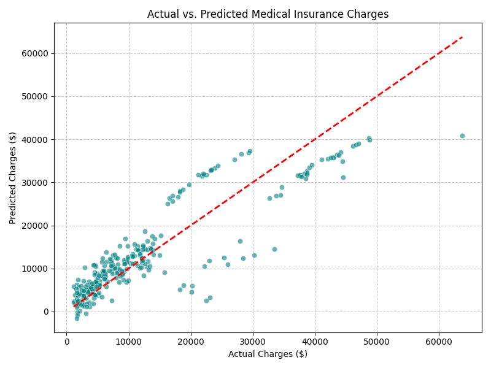

# Medical Insurance Cost Prediction using Multiple Linear Regression

## Objective
To build a Multiple Linear Regression model to accurately estimate and predict medical insurance charges for customers based on their demographic features and health-related attributes.

## Dataset Link
*   **Dataset URL:** https://www.kaggle.com/datasets/mirichoi0218/insurance

## Libraries Used
*   pandas
*   numpy
*   scikit-learn
*   matplotlib
*   seaborn

## Methodology
1.  **Data Understanding:** Inspected data features. Identified numerical columns (`age`, `bmi`, `children`), categorical elements (`sex`, `smoker`, `region`), and the target variable (`charges`).
2.  **Preprocessing:** Verified zero missing values across columns. Transformed categorical variables using One-Hot Encoding (`pd.get_dummies`) with `drop_first=True` to eliminate multi-collinearity issues (dummy variable trap).
3.  **Data Splitting:** Divided data dynamically into an 80% training set and a 20% test set to evaluate real-world generalizability.
4.  **Modeling:** Fitted a Multiple Linear Regression line targeting the minimized sum of squared residuals.
5.  **Evaluation:** Documented performance via MAE, MSE, and R² scores alongside residual visualization graphs.
## Results
*   **Mean Absolute Error (MAE):** ~$4,181.19
*   **Root Mean Squared Error (RMSE):** ~$5,796.28
*   **R² Score:** ~0.7833

### Visualizations
*The plot generated by the code highlighting the identity line vs. predicted values:*

### Key Observations
*   The model achieves a solid baseline performance, explaining roughly 78.3% of the target variation.
*   The variance increases sharply for high-value claims, suggesting the presence of critical feature interactions not captured natively by basic additive linear regression lines.

## Conclusion
*   **Key Findings & Drivers:** Smoking status is by far the single heaviest driver altering premium scales, followed closely by age steps and BMI indices. 
*   **Limitation:** A core flaw of standard Linear Regression here is its assumption of strictly additive, straight-line relationships. In medical environments, risk functions exponentially jump when severe parameters compound—such as high BMI interacting directly with a smoking habit. Tree-based ensembles or polynomial transformation variants are required to capture these interactions accurately.